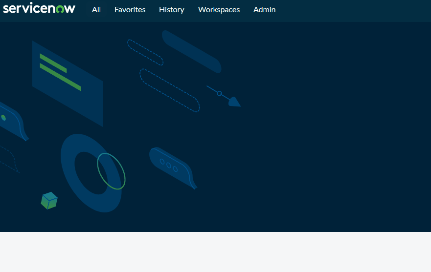

# My ServiceNow Ticketing System Portfolio

This project showcases my hands-on experience and proficiency with the ServiceNow platform, focusing on its core ticketing systems for managing **Interactions** and **Incidents**.

## Getting Started with ServiceNow

### Setting Up a Personal Developer Instance (PDI) 🏡
To gain hands-on experience, I utilized a **Personal Developer Instance (PDI)**. This free, dedicated environment allowed me to explore and practice with the platform's features without affecting a live production system.

**Steps for PDI Setup:**
* Navigate to the [ServiceNow Developer Program](https://developer.servicenow.com/).
* Create an account by clicking **Sign-up and Start Building**.
* Once registered, log in to provision your personal instance.

---

## Mastering Platform Navigation

Efficient navigation is crucial for effective work within ServiceNow. I've streamlined my workflow using key platform features.

### Bookmarking Favorites ⭐
I created bookmarks for frequently used lists, such as "Interactions" and "Incidents," to ensure quick and easy access.

**How to Bookmark:**
1.  Use the navigation filter to find a specific list (e.g., "Interactions").
2.  Search the desired list by typing into the filter box (e.g., **Interactions**).
3.  Click the star icon next to the list's name in the navigation pane.

Your bookmarked shortcuts will then appear under the **Favorites** tab.

  

---

## Working with Interactions 🤝

An **Interaction** is a record of initial contact with a user, often an inquiry that may not involve a technical issue. It serves as a critical first step in logging communication.

### Creating an Interaction
* From your **Favorites** tab, click the shortcut to create a new Interaction.
* Fill in required details like **Contact type**, **Opened for**, and a **Short Description**.
* Click **Submit** to create the record.

### Key Workflows
* **Managing Interactions**: I managed open interactions by quickly accessing the bookmarked list from my **Favorites** tab.
* **Completing a Ticket**: When an inquiry was resolved, I closed the interaction by clicking the **Complete** button.

### Converting an Interaction to an Incident 🔄
If an inquiry escalates into a technical issue, it must be converted into an **Incident** for proper tracking and management.

**Steps to Convert:**
1.  While in the Interaction record, click the **Create Incident** button.
2.  ServiceNow will automatically create a new Incident record with details from the Interaction.
3.  **Important**: You must return to the original Interaction ticket and **Close** it to prevent both tickets from remaining open for the same issue.

---

## Managing Incidents 🚨

An **Incident** is defined as an unplanned interruption to an IT service. Managing these is a core function of IT service management (ITSM).

### Creating an Incident
* From your **Favorites** tab, click the shortcut to create a new Incident.
* Fill in critical details such as **Caller**, **Short Description**, **Impact**, and **Urgency** to determine the ticket's priority.
* Assign the ticket to the appropriate group (e.g., **Help Desk**).
* Click **Submit** to create the incident.

### Key Workflows
* **Ticket Assignment**: I located and assigned unassigned incidents directly from my **Favorites** tab.
* **Work Documentation**: I used the **Work Notes** section to add details about my troubleshooting steps and updates, creating a clear record of my work.
* **Knowledge Management**: When a resolution was reusable, I clicked the **Knowledge** button in the **Resolution Information** section. This creates a knowledge article to help other team members resolve similar issues in the future.
* **Resolving the Ticket**: Once an issue was resolved, I clicked the **Resolve** button to close the ticket and record the final resolution details.
